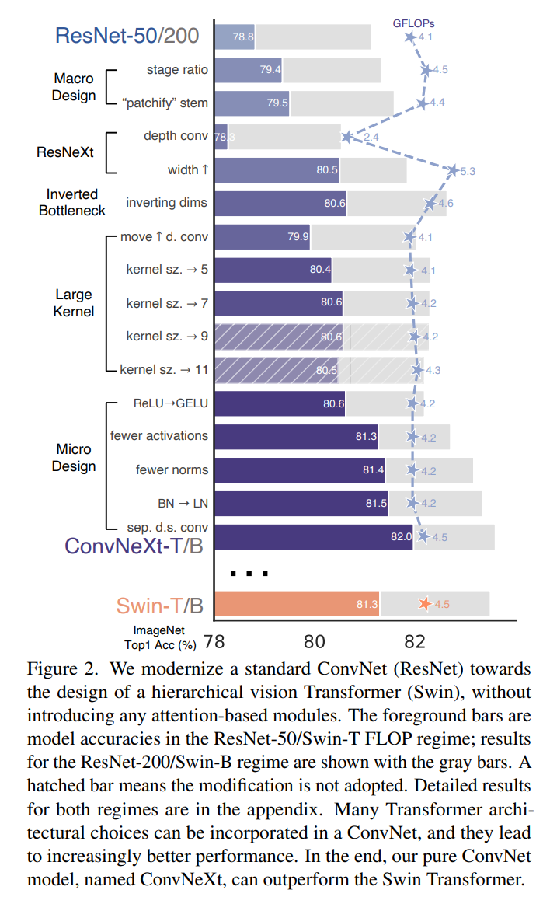
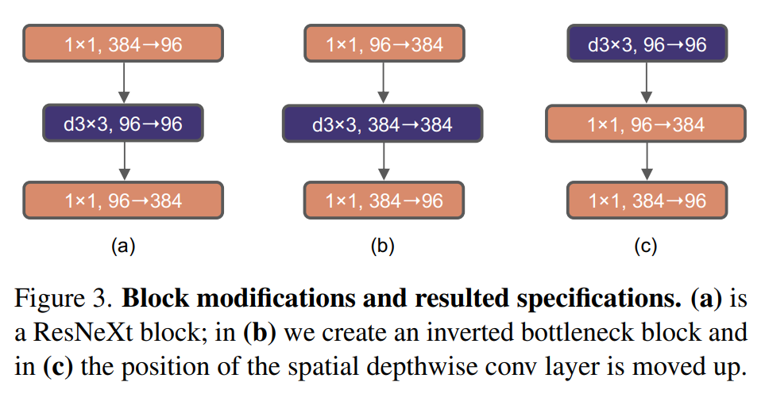

# ConvNeXt 学习笔记
*原文：[A ConvNet for the 2020s](https://arxiv.org/abs/2201.03545)*

## Abstract 摘要
自从 ViT 被发明并迅速取代 CNN 作为最优秀的图像分类模型，图像识别的黄金时代就开始了。但是，朴素的 ViT 并不能很好地解决所有的 CV 任务，比如对象检测和语义分割等。分层 Transformer（例如 Swin Transformer）重新引入了一些 CNN 先验（priors），使得 Trasnformer 在实践中能够作为一个通用的视觉根基（vision backbone），并在大量的视觉任务上表现优秀。然而，这种复合算法之所以表现优秀，还是因为 Tranformer 固有的优势，而非因为卷积本身的先验假设。在本文中，我们重新审视了设计方式，测试纯粹的 CNN 究竟能达到多高的表现水平。我们将根据 ViT 的设计逐渐改进一个标准 ResNet，并探究影响表现的主要因素。最后，我们提出一个标准 CNN 模型，我们将其称为 ConvNeXt。ConvNeXt 比 Transformer 能拥有更高的准确率和可扩展性，同时也保留了标准 CNN 的简易性和高效性。

## 1. Introduction 导言
2010 年至 2019 年，深度学习领域出现了里程碑式的突破，其主要代表是神经网络的复兴，尤其是 CNN（CNN）。图像识别领域的重点从特征工程走向了（CNN）结构设计。虽然后向传递的 CNN 早在 1989 年就已经出现了，但直到 2012 年我们才挖掘出它用于图像特征学习的强大潜能。AlexNet 的引入和同年的“ImageNet moment”（AlexNet 在 ILSVRC2012 取得了远远超过传统方法的准确率提升，这一事件被称为 ImageNet moment），标志着 CV 领域走向了新时代。自此，CV 领域飞速发展，代表性的 CNN，像 VGGNet、Inceptions、ResNe(X)t、DenseNet、MobileNet、EfficientNet 和 RegNet 分别聚焦于准确率、高效性和可扩展性等多个方面，产生了许多有用的设计准则。

CNN 在 CV 界的主导地位并非偶然：“滑动窗口”策略在处理图像时几乎是默认的标准，尤其是在处理高分辨率图像时。CNN 天生带有的先验假设，使得它们适合处理各种各样的 CV 任务。其中最重要的就是平移不变性，这对对象检测之类的任务作用很大。由于 CNN 共用卷积核，所以也具有高效性。在过去几十年里，标准 CNN 一般用于一些特定的、有限的对象类别，例如数字、人脸、行人等。进入 21 世纪 10 年代，基于区域的检测器（region-based detectors）进一步将 CNN 提升成了视觉识别系统中的基本组件。

与此同时，NLP 的神经网络设计走上了另一条不同的道路。Transformer 替代 RNN 成为了主流的模型基石。尽管 CV 和 NLP 有着不同的任务和需求，二者却在 2020 年合流了——ViT 的引入彻底改变了网络架构。除了初始化时将图像拆分为多个补丁，ViT 并没有引入什么关于图像的先验假设，在原始 Transformer 上做的修改也相当少。受益于大模型和大数据集的帮助，Transformer 能够比标准的 ResNet 表现更优秀，尤其是在图像分类上。然而，CV 并不只有图像分类。过去几十年提出的模型都是基于滑动窗口和卷积的，而没有这些先验假设的 ViT 会在其他任务上面临很多挑战。最大的挑战是 ViT 的全局自注意力结构，它的复杂度和输入大小成二次相关。或许这对 ImageNet 分类任务来说还算可以接受，但若要处理更高分辨率的输入，就会十分棘手了。

分层 Transformer 使用复合算法来解决这个问题。例如，“滑动窗口”策略被再次引入 Transformer，使得它们和 CNN 有着更近似的表现。Swin Transformer 就是这一方向上的里程碑，它第一次表明 Transformer 可以被改进并用于大量的 CV 任务，且达到最优秀的表现。这说明卷积并没有成为时代的眼泪，相反地，它一直都是十分必要的。

从这一点出发，很多人尝试将卷积带回到 Transformer 中。遗憾地，添加卷积总有代价：朴素的滑动窗口自注意力机制计算费用过于昂贵；使用循环移位能提升速度，但又让模型变得过于复杂。讽刺的是，CNN 天然就拥有我们想要的这些特性，表现却劣于 Transformer。

和 CNN 的逐步进化不同，ViT 的进化是阶梯性的。在最近的文献中，CNN 和分层 ViT 有异有同：它们都使用了类似的先验假设，但在模型架构和训练方式上却截然不同。在本文中，我们研究了 CNN 和 Transformer 架构上的不同点，并尝试找出评估模型表现时的干扰因素。我们的研究目的是跨越 ViT 发明前后两个时代，CNN 所应跨越的鸿沟，同时探究朴素 CNN 究竟能达到多高的表现水平。

为此，我们从一个标准 ResNet（例如 ResNet-50）开始。我们将一点点改进，使其变为一个分层 ViT（例如 Swin-T）。这就引出了一个重要问题：究竟是 Transformer 的什么设计，影响了 CNN 的表现？针对这一问题，我们研究并发现了一些影响模型表现的关键因素，并提出一个标准 CNN 模型，我们将其称为 ConvNeXt。令人惊喜的是，ConvNeXt 在所有主流测试上的准确率、可扩展性和泛用性均高于 Transformer，同时保留了 CNN 结构的简易性，使其极其容易实现且高效。

我们希望这一发现能影响过去的某些主流观点，并鼓励人们去重新思考 CV 中卷积的重要性。

## 2. Modernizing a ConvNet: a Roadmap 使一个 CNN 变得现代化：改进过程
本节，我们将说明如何将一个 ResNet 改造为一个类似 Transformer 的 CNN。

我们考虑两对同等 FLOPs 的模型，一对是 ResNet-50 和 Swin-T（FLOPs 约为 $4.5 \times 10^9$），另一对是 ResNet-200 和 Swin-B（FLOPs 约为 $15.0 \times 10^9$）。简单起见，我们仅展示 ResNet-50 和 Swin-T 的结果，更大模型的结构是类似的，可以在附录 C 中找到。

改进过程如下。首先，用类似 ViT 的训练方法训练 ResNet-50，得到比原始的 ResNet-50 优秀许多的结果，将其视为 baseline。接下来，我们研究了一系列的改动，可以总结为：1）宏观层面设计；2）ResNeXt 设计；3）逆向 bottleneck；4）更大的核大小；5）细节层面设计。图 2 展示了调整过程。考虑到模型复杂度和表现水平相关，我们努力控制了调整过程的 FLOPs，避免其发生过大变化。所有模型都在 ImageNet-1K 上训练和评估。

### 2.1. Training Techniques 训练方式
除了网络架构，训练方式也会影响最终效果。ViT 不仅引入了新的网络结构，还引入了新的训练方式（例如 AdamW 优化器）。最近的研究表明，现代化的训练方式能相当程度上影响 ResNet-50 的表现，因此我们使用和 DeiT 及 Swin Transformer 相近的现代化训练方法。首先，epoch 数由原来的 $90$ 改为 $300$。接着，我们使用 AdamW 优化器，数据处理则使用 Mixup、Cutmix、RandAugment、Random Erasing、Stochastic Depth 和 Label Smoothing。超参数的具体的值可以在附录 A.1 找到。这一改进让准确率从 $76.1\%$ 提升到了 $78.8\%$，说明传统 CNN 和 ViT 的表现区别有可能是因为训练方式不同产生的。

### 2.2. Macro Design 宏观层面设计
接下来，我们分析 Swin Transformer 在宏观层面上的设计。Swin Transformer 和 CNN 一样使用了多阶段设计（multi-stage design），每一阶段图像分辨率都不同。有两点是值得注意的：一是每个阶段 bottleneck 的个数，二是预处理时降采样的方式。

**调整阶段 bottleneck 的个数**。Swin-T 使用的阶段 bottleneck 个数比为 $1:1:3:1$，更大一点的 Swin Transformer 则为 $1:1:9:1$。据此，我们将 ResNet-50 每个阶段的块个数从 $(3, 4, 6, 3)$ 调整为 $(3, 3, 9, 3)$。这使得模型准确率从 $78.8\%$ 提升到了 $79.4\%$，同时 FLOPs 也和 Swin-T 相等。值得一提的是，有人针对这一比例进行了研究，也可能存在比这更好的设计。

**将卷积改为补丁**。由于图像本身具有冗余的信息，所以 CNN 和 ViT 都会在一开始对图像进行激进的降采样处理。CNN 中的实现方式是一个核大小为 $7 \times 7$、步长为 $2$ 的卷积层，加上一个最大池化层，使得图像分辨率变为原来的 $\frac 14$。ViT 的实现方式则更为激进：ViT 将图像转为多个补丁，等价于核大小较大（例如 $14 \times 14$ 或 $16 \times 16$）且不重叠的卷积。Swin Transformer 和后者类似，但使用的核大小仅为 $4 \times 4$，使其适应模型的多阶段设计。我们将 ResNet 的这一卷积层改为一个核大小为 $4 \times 4$、步长为 $4$ 的卷积层，这和 Swim Transformer 的补丁化本质一致。这将准确率从 $79.4\%$ 提升到了 $79.5\%$。

### 2.3. ResNeXt-ify ResNeXt 化
在本节，我们考虑使用 ResNeXt 的改进思路，使得我们能以较少的 FLOPs 增大带来较大的准确率提升。ResNeXt 的一个重要改进就是分组卷积：将 bottleneck 的 $3 \times 3$ 卷积层改为组卷积，同时增大网络宽度以弥补改动带来的容量损失。

这里，我们使用深度可分离卷积（depthwise convolution）。深度可分离卷积已在 MobileNet 和 Xception 中被使用，并推广到其他模型中。值得注意的是，使用一层深度可分离卷积和一层 $1 \times 1$ 卷积可以先后（而不是同时）实现空间维度的处理和不同通道信息之间的混合，这和 ViT 是异曲同工的。参照 ResNeXt 的处理方法，我们在使用深度可分离卷积的同时将初始通道数从 $64$ 改为 $96$，和 Swin-T 一样。这将模型的准确率提升到 $80.5\%$，FLOPs 增加到 5.3G。

### 2.4. Inverted Bottleneck 逆向 bottleneck
Transformer 的另一个重要设计是它创建了倒转的 bottleneck，即 MLP 块隐藏层的维数是输入维数的 $4$ 倍（见图 $\color{red}4$）。可以发现，这一设计和 CNN 中膨胀倍数（expansion ratio）为 $4$ 的逆向 bottleneck 是相近的，而这一性质也被 MobileNetV2 推广，并在随后的一些 CNN 架构中得到关注。

这里我们重点探究逆向 bottleneck 的设计。图 $\color{red}3$ (a) 和 (b) 分别展示了 ResNeXt 的 bottleneck 和我们使用的逆向 bottleneck 的设计。使用这一设计，FLOPs 降到了 4.6G，且有趣的是，准确率反而从 $80.5\%$ 上升到了 $80.6\%$。对于 ResNet-200 / Swin-B，这一提升更加明显，从 $81.9\%$ 提升到 $82.6\%$。

### 2.5. Large Kernal Sizes 更大的卷积核
在本节，我们重点关注大卷积核的表现能力。ViT 和 CNN 最主要的区别之一，便是 ViT 自注意力机制的全局性。相反地，CNN 的黄金准则却是堆叠核较小（$3 \times 3$）的卷积层，这使得卷积在现代 GPU 上能够高效地运算。Swin Transformer 虽然引入了滑动窗口，但窗口的大小至少也是 $7 \times 7$，明显比 CNN 要大得多。因此，我们重新考虑 CNN 中大卷积核的表现和性能。

**把深度可分离卷积层前移**。研究大卷积核的前置条件是前移深度可分离卷积层（图 $\color{red}3$ (b) 到 (c)）。这一设计在 Transformer 中也有体现：MSA 块比 MLP 层放在更前的位置。既然我们已经有了逆向 bottleneck，这一设计也是自然的——复杂模块（MSA，大卷积核卷积层）应当有较少的通道数，而简单高效的 $1 \times 1$ 卷积层应当负责这一重活。这将 FLOPs 降到 4.1G，同时准确率暂时降低到 $79.9\%$。

**增加卷积核大小**。我们尝试了以 $3, 5, 7, 9$ 和 $11$ 作为卷积核大小，最后发现当卷积核大小设为 $7 \times 7$ 时准确率最高，从 $79.9\%$ 增加到 $80.6\%$，而模型的 FLOPs 几乎不变。

### 2.6. Micro Design 细节设计
在本节，我们探究一些细节上的设计，大部分聚焦于激活函数和标准化层的调整。

**用 GELU 替换 ReLU** 在最近的 Transformer 和 ViT 中，基本都使用了 GELU 而不是 ReLU。实验证明，用 GELU 替换 ReLU 并不会改变我们模型的准确率。

**更少的激活函数**。Transformer 和 ResNet 的一个小区别是：Transformer 使用的激活函数较少。一个 Transformer 块包含键值 / 查询 / 求值（key/query/value）线性嵌入层、映射层和 MLP 块的两个层。整个块中只有一个激活函数，出现在 MLP 层内。与之相比，CNN 中几乎每个卷积层都有一个激活函数。如图 $\color{red}4$，我们将残差块中所有的 GELU 层移除，只保留两个 $1 \times 1$ 卷积层之间的 GELU。这使得准确率从 $80.6\%$ 提升到 $81.3\%$，和 Swin-T 的表现几乎相当。

**更少的标准化层**。类似地，我们移除两个 BN 层，将模型准确率提升至 $81.4\%$。注意：此处我们的 BN 层数量少于 Transformer 有的 BN 层数量，这是因为实验表明在块前增加多一层 BN 并不会提高准确率。

**用 LN 替换 BN**。BN 能促进 CNN 的收敛并抑制过拟合，但也存在一些错综复杂的因素，会影响模型的表现。许多人尝试用别的标准化层替换 BN，然而 BN 仍然是 CV 界的标准选择。另一方面，Transformer 使用的则是 LN（layer normaliztion）。

直接用 LN 替换 BN 会降低模型的准确率。但在经过这些各种各样的调整后，我们的 CNN 就可以使用 LN 了；这还将准确率提升到了 $81.5\%$。

**分离降采样层**。在 ResNet 中，降采样通过步长为 $2$ 的 $3 \times 3$ 卷积（以及捷径中步长为 $2$ 的 $1 \times 1$ 卷积）实现。在 Swin Transformer 中，则是用一个分离的降采样层实现。我们也采取类似的策略，用步长为 $2$ 的 $2 \times 2$ 卷积层实现降采样，然而这样做却出乎意料地导致模型训练时难以收敛。更进一步的研究表明，在分辨率降低处添加标准化层能使得训练更加稳定。这一策略也在 Swin Transformer 中使用。通过这一调整，准确率提高到了 $82.0\%$，明显超过了 Swin-T 的 $81.3\%$。

于此，我们得到了最终模型 ConvNeXt。

ResNet、Swin 和 ConvNeXt 块结构的对比可参见图 $\color{red}4$。ResNet-50、Swin-T 和 ConvNeXt-T 的具体架构规范可参见表 $\color{red}9$。

**结语**。ConvNeXt 作为一个纯粹的 CNN，在 ImageNet-1K 分类问题上表现优于 Swin Transformer。值得一提的是，所有的设计改进都是受 ViT 启发而来的，但却不是什么新颖的改进——它们早在过去就已经被研究过了，只是没有统一地整合而已。我们的 ConvNeXt 和 Swin Transformer 有着几乎一样的 FLOPs、参数数量、吞吐量和占用内存，但并不需要像滑动窗口注意力机制、相对位置偏置之类的特定模块。

这一发现是振奋人心的，但我们的研究还没有结束——至今为止的研究都局限在较小的图像中，但 ViT 的优点正是其强大的缩放能力。此外，CNN 能否在例如对象检测和语义分割之类的下游任务中胜过 Swin Transformer 也是 CV 界重点关注的问题之一。在下一节中，我们将在数据和模型大小两个方面扩大 ConvNeXt，并在一系列的图像识别任务中评估 ConvNeXt 的表现。

## 3. Empirical Evaluations on ImageNet 在 ImageNet 上进行实验评估
我们构建了 ConvNeXt-T/S/B/L，与同等复杂度的 Swin-T/S/B/L 进行对比。ConvNeXt-T/B 便是 ResNet-50/200 经过改进后得到的结果。
