# RepLKNet 学习笔记
*原文：[Scaling Up Your Kernels to 31x31: Revisiting Large Kernel Design in CNNs](https://arxiv.org/abs/2203.06717)*

## Abstract 摘要
我们重新研究了如何在 CNN 中设计大卷积核。受近期 ViT 发展的启发，在本文中，我们通过实验说明了使用少数几个大卷积核比使用一叠小卷积核会有更优的表现。我们提出了五个准则（例如使用重新参数化（re-parameterized）的深度可分离大卷积），以设计优秀的大卷积核 CNN。基于上述准则，我们提出了纯 CNN 模型 RepLKNet，它拥有大到 $31 \times 31$ 的卷积核。RepLKNet 极大地弥补了 CNN 和 ViT 之间的准确率差距，同时具有较低的计算费用。在大数据和大模型方面，RepLKNet 也展现出了出色的可缩放性（scalability）。另一方面，我们的研究也表明，大卷积核使得 CNN 更关注于对象的形状，而不是对象的纹理。

## 1. Introduction 导言
CNN 曾经是 CV 系统的通用模型。然而 ViT 的出现，让 CNN 的主导地位受到了极大的挑战。为何 ViT 如此强大？一些研究认为，关键因素是 ViT 中的 MHSA（multi-head self-attention）机制。他们认为 MHSA 更加灵活且包容性强（具有更少的先验假设），对失真有更强的适应能力。但另一些研究却认为 MHSA 并非是必要的，ViT 的强大是因为更优秀的构建模块（building blocks）和 / 或动态稀疏权重（dynamic sparse weights）。还有很多的研究，从其他方面解释了 ViT 的先进之处。

在本文中，我们重点关注其中的一个方面：构建大感受野的方式。在 ViT 中，MHSA 要么是全局性的，要么是带着大感受野的、局部性的，因而每个输出都能从一个巨大的区域里收集信息。与之相反，CNN 中则强调使用小卷积进行计算。这一事实自然引出了一个问题：我们能否用少数几个大卷积核，去取代 CNN 中的一叠小卷积核？大感受野是不是弥补 CNN 和 ViT 之间准确率之间的关键？

为了回答这个问题，我们系统地探究了 CNN 的大卷积核设计。我们遵循一个非常简单的设计哲学：直接将 DW（depth-wise，深度可分离）大卷积层添加到 CNN 里（核大小从 $3 \times 3$ 到 $31 \times 31$），而不使用别的方法（例如特征三角、膨胀卷积和可变形卷积等）。通过一系列的实验，我们总结了五条经验准则：**1**) 大卷积可以高效计算；**2**) 恒等捷径（identity shortcut）是必要的，尤其对带大卷积核的网络而言；**3**) 使用小卷积核进行重参数化（re-parameterizing）可以解决优化问题；**4**) 大卷积对下游任务表现的提升作用，远大于对 ImageNet 分类表现的提升作用；**5**) 即使对小特征图，大卷积核也是有用的。

基于上述准则，我们提出了纯 CNN 模型 RepLKNet，它使用重新参数化的大卷积层来扩大感受野。该模型在宏观设计上遵循了 Swin Transformer，并做了一些微小的改动，例如将多头自注意力层替换为 DW 大卷积层。考虑到 ViT 在大数据和大模型方面表现优秀，我们主要评估中等大小和较大大小模型的表现。我们的基准模型仅在 ImageNet-1K 上训练，就能在 ImageNet 分类问题上达到 $84.8\%$ 的准确率，超过了大小相近的 Swin-B $0.3\%$，且计算效率更高。

更重要的是，我们发现大卷积核在下流任务中也非常有用。若给予更多的预训练数据（例如 $7300$ 万张图像）和计算经费，我们的最佳模型可以在 ImageNet 分类问题上达到 $87.8\%$ 的准确率，在 ADE20K 上达到 $56.0\%$ 的准确率。

我们认为 RepLKNet 的出色表现主要归功于其极大的有效感受野（effective receptive fields），参见图 $\color{red}1$。并且，RepLKNet 相比于传统 CNN 更重视对象的形状，这和人类的认知方式较为相近。我们希望，我们的研究能对人们理解 CNN 和 ViT 的内在机制起到一定的帮助。

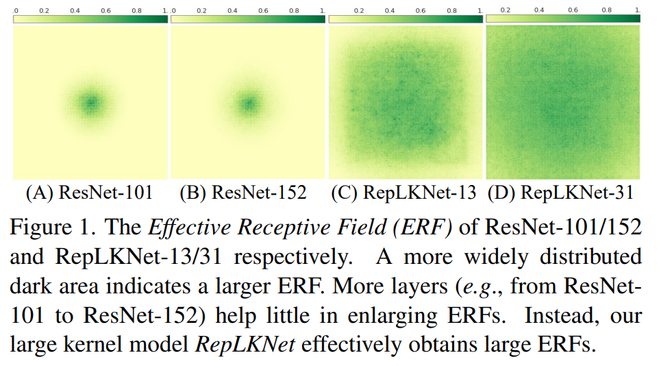

## 2. Related Work 相关工作
略

## 3. Guildlines of Applying Large Convolutions 使用大卷积的准则
在 CNN 中直接使用大卷积通常会降低准确率和速度。在本节中，我们总结了 $5$ 条高效地使用大卷积的准则。

**准则 $1$： DW 的大卷积可以高效计算**。使用 DW 卷积，可以很大程度上缓解大卷积导致的参数量和 FLOPs 过大的问题。例如，在 RepLKNet（细节参见表 $\color{red}5$）中，将不同阶段的核大小从 $[3, 3, 3, 3]$ 改为 $[31, 29, 27, 13]$ 仅会将 FLOPs 和参数量分别提升 $18.6\%$ 和 $10.4\%$。剩下的 $1 \times 1$ 卷积占了计算量的大头。

有人可能会担心， DW 卷积在 GPU 上难以高效地进行平行运算。这对传统的 $3 \times 3$ 卷积是成立的，因为在 DW 卷积中，计算量与内存占用之比相当小，自然对 GPU 不友好。然而当核大小变大时，计算密度就增加了：例如在 $11 \times 11$ 的 DW 卷积中，每个特征值都会参与 $121$ 次运算，而在 $3 \times 3$ 时只会参与 $9$ 次。因而，根据最优模型的运算结果，实际计算时间并不会像 FLOPs 增长得那么多。

**注 $1$**。不幸地，我们发现现成的深度学习工具（例如 Pytorch）对 DW 大卷积支持较差，如表 $\color{red}1$。因此，我们尝试用一些方法来优化 CUDA 设备的计算。虽然基于 FFT 的方法看起来比较合适，但我们在实践中发现 block-wise (inverse) implicit gemm algorithm 是个更好的选择。这一算法已经在开源框架 MegEngine 中实现，我们忽略这些细节。此外，我们也为 PyTorch 编写了一个高效的实现。表 $\color{red}1$ 说明我们的实现相比 Pytorch 要高效得多，使用我们的实现， DW 卷积只增加了 $12.3\%$ 的运行时间，而非 $49.5\%$。

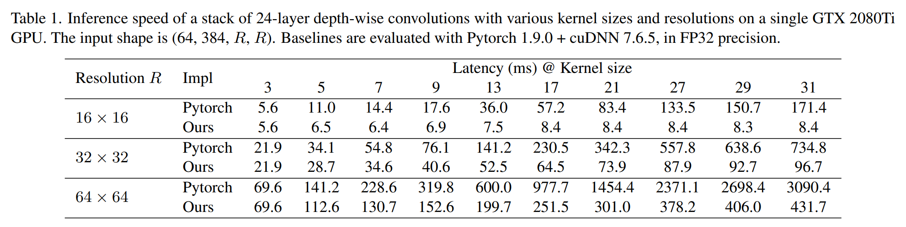

**准则 $2$：恒等捷径是必要的，尤其对带大卷积核的网络而言**。考虑到 MobileNet V2 模型大量使用 DW 卷积，且有带捷径和不带捷径的两个变种，我们以 MobileNet V2 为例展示这一准则。我们直接将 $3 \times 3$ 的 DW 卷积换为 $13 \times 13$ 的 DW 卷积作为对比，在 ImageNet 上训练 100 个 epoch（细节参见附录 A）。表 $\color{red}2$ 说明，使用大卷积核能将带捷径的 MobileNet V2 的准确率提升 $0.77\%$，但若删去捷径，准确率直接降到了 $53.98\%$。

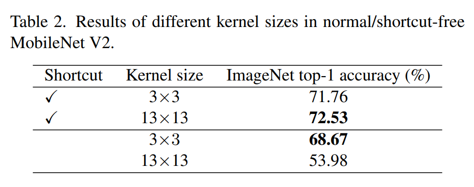

**注 $2$**。这一准则对 ViT 也适用。最近一项研究发现，随着深度增加，没有恒等捷径的 ViT 会严重失去注意能力，使得网络输出过于模糊。恒等捷径可以使得模型拥有不同大小的感受野，这使得 RepLKNet 能够在拥有大感受野的同时保留探测小区域模式的能力。

**准则 $3$：使用小卷积核进行重参数化可以解决优化问题**。我们将 MobileNet V2 的 $3 \times 3$ 卷积层分别换成 $9 \times 9$ 和 $13 \times 13$，并选择性地进行结构重参数化（structural reparameterization）。具体地，我们在大卷积层旁边平行地添加一个 $3 \times 3$ 的卷积层，并将 BN 层后的输出加总（图 $\color{red}2$）。训练结束后，我们将小卷积核与其 BN 参数合并到大卷积核中，这样最终模型和训练模型是等价的，但不再需要计算小卷积核。表 $\color{red}3$ 说明直接将核大小从 $9$ 增加到 $13$ 会降低准确率，而重参数化能解决这个问题。

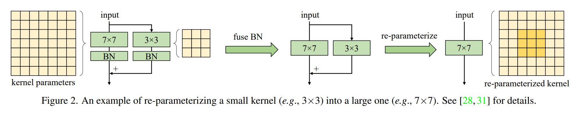

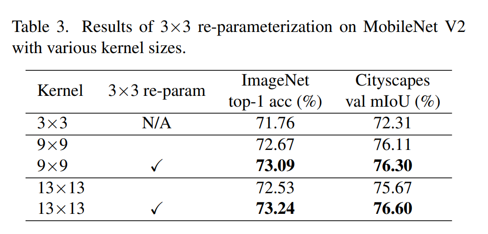

我们把在 ImageNet 预训练好的模型迁移到 Cityscapes 数据集上的语义分割任务上，使用 DeepLabv3+ 架构。我们只替换了模型的主干架构，保留 MMSegmentation（一个开源的图像分割工具库）提供的默认配置。实验结果和 ImageNet 类似：$3 \times 3$ 重参数化将 $9 \times 9$ 模型的 mIoU 提升了 $0.19$，将 $13 \times 13$ 模型的 mIoU 提升了 $0.93$。使用重参数化使得大卷积核不再降低准确率。

**注 $3$**。众所周知，ViT 在小数据上的优化存在一定问题。一种解决方式是引入卷积性先验假设（convolutional prior），例如添加一个 $3 \times 3$ DW 卷积到每个自注意力模块中，这和我们的做法是相似的。这些策略引入了更多的平移不变性和局部性先验假设，使得网络在不丢失泛用性的前提下更容易在小数据上进行训练。我们也发现当预训练集扩大到 $7300$ 万张图像时（参见下节的 RepLKNet-XL），重参数化不会导致退化现象，这和 ViT 是相似的。

**准则 $4$：大卷积对下游任务表现的提升作用，远大于对 ImageNet 分类表现的提升作用**。表 $\color{red}3$（重参数化后）说明将 MobileNet V2 从 $3 \times 3$ 提升到 $9 \times 9$ 使得 ImageNet 的准确率提升了 $1.33\%$，但 Cityscapes 的 mIoU 却提升了 $3.99\%$。表 $\color{red}5$ 也说明了类似的趋势：当核大小从 $[3, 3, 3, 3]$ 增加到 $[31, 29, 27, 13]$ 时，ImageNet 准确率仅提升了 $0.96\%$，而 ADE20K 的 mIoU 却提升了 $3.12\%$。这一现象表明，即使模型在 ImageNet 任务上表现相近，也可能在下游任务中表现不同（参见表 $\color{red}5$ 的最下面 $3$ 个模型）。

**注 $4$**。什么因素导致了这一现象的发生？首先，大卷积核显著地提高了有效感受野的大小。许多研究表明，上下文信息对许多诸如对象检测和语义分割一类的下游任务来说相当重要，而这正需要较大的有效感受野。我们会在第 $\color{red}5$ 节讨论这个话题。其次，我们认为引发这一现象的另一个原因，可能是大卷积核使得网络对对象的形状有更大的偏好，而不是对象的贴图。一般来说，判断对象的贴图或形状都可以正确分类 ImageNet 的数据，然而人类识别物体的方式更多是依靠对象的形状。这表明，若网络对形状有更大的偏好，那么它可能在下游任务里能表现得更好。近期一项研究表明，ViT 有较高的形状偏置，这或许说明了 ViT 为何在下游任务中表现得如此出色。相反地，在 ImageNet 上训练的传统 CNN 则拥有更多的贴图偏置。幸运地，我们发现仅仅增加 CNN 的卷积核大小，就能增加模型的形状偏置。细节参见附录 C。

**准则 $5$：即使对小特征图（例如 $7 \times 7$），大卷积核（例如 $13 \times 13$）也是有用的**。为验证这一点，我们将 MobileNet V2 的最后一阶段的 DW 卷积扩大到 $7 \times 7$ 或 $13 \times 13$，这样卷积大小就等于甚至大于特征图的大小（默认为 $7 \times 7$）。我们根据准则 $3$ 对大卷积进行重参数化。表 $\color{red}4$ 说明，尽管 MobileNet V2 最后一阶段的卷积核本来就足够大，再增加卷积核大小仍然能提升表现水平，尤其是在像 Cityscapes 这样的下游任务中。

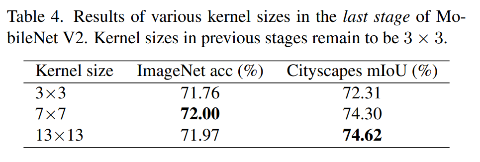

**注 $5$**。需要注意的是，当卷积核变大时，CNN 的平移不变性并不会严格成立。如图 $\color{red}3$ 所示，两个相邻的区域仅共有一小部分权重，也即是说，这两个区域是被不同映射计算的。这一性质也和 ViT 相似——放宽平移不变性的限制，以得到更大的泛用性。有趣的是，我们发现 Transformer 系列模型中被广泛使用的 2D 相对位置嵌入（relative position embedding）也可以视为一个 $(2H - 1) \times (2W - 1)$ 的 DW 卷积，其中 $H, W$ 是特征图的高和宽。大卷积让模型不仅能学习相对位置，还能把绝对位置编码到计算中。

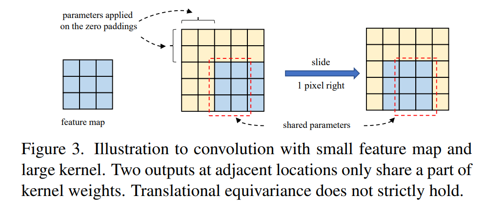

## 4. RepLKNet: a Large-Kernal Architecture RepLKNet：大卷积核架构
在本节，我们基于上述准则提出纯 CNN 模型 RepLKNet。据我们所知，目前的 CNN 仅在小模型领域占主导地位，大模型领域则被 ViT 占领。因此，在本文中我们主要聚焦于相对更大的模型（复杂度不低于 ResNet-152 或 Swin-B），以此验证大卷积核能否弥补 CNN 与 ViT 之间表现的鸿沟。

### 4.1. Architecture Specification 架构规范
我们在图 $\color{red}4$ 中描述了 RepLKNet 的架构。

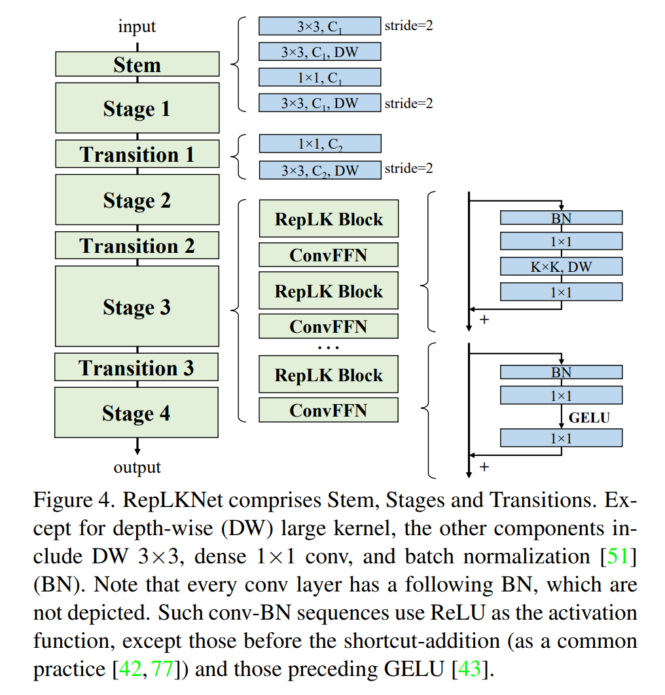

**Stem** 指代开头层。为了让模型在下游任务表现出色，我们在开头使用多个卷积层以获得更多信息。我们先使用步长为 $2$ 的 $3 \times 3$ 的普通卷积进行一次降采样，再用 $3 \times 3$ 的 DW 卷积捕获初级模式，最后用 $1 \times 1$ 的卷积和另一个步长为 $2$ 的 $3 \times 3$ DW 卷积进行降采样。

**阶段** $1-4$ 分别含有若干个 RepLK 块，它们使用了捷径（准则 $2$）和 DW 大卷积（准则 $1$）。根据一般经验，我们在 DW 卷积前后各使用一次 $1 \times 1$ 卷积。注意每个 DW 卷积会使用 $5 \times 5$ 卷积进行重参数化（准则 $3$），这在图 $\color{red}4$ 中是没有显示的。除了和能提供大感受野并统计整体信息的大卷积有关之外，模型的表现力还和模型的深度有关。为了提供更多的非线性信息，我们决定使用 $1 \times 1$ 卷积增加模型深度。受 Transformer 和 MLP 中广泛使用的前馈网络（feed-forward network, FFN）启发，我们构建了 ConvFFN 块，它由捷径、BN、两个 $1 \times 1$ 层和 GELU 组成。相比于传统 FFN 使用的 LN 层，BN 层可以与卷积结合进行高效运算。根据一般经验，ConvFFN 块内部的通道数是输入的 $4$ 倍。遵循 ViT 和 Swin 的设计，我们在每个 RepLK 块后放置一个 ConvFFN 块。

**过度块**放置在不同阶段之间。它们先用 $1 \times 1$ 卷积增加通道数，再用 $3 \times 3$ DW 卷积进行 $2$ 倍的降采样。

总的来说，每个阶段共有三个结构超参数：RepLK 块的数量 $B$，通道数 $C$，卷积核大小 $K$。因而一个 RepLKNet 的结构可由 $[B_1, B_2, B_3, B_4], [C_1, C_2, C_3, C_4], [K_1, K_2, K_3, K_4]$ 决定。

### 4.2. Making Large Kernals Even Larger 让大卷积核变得更大
我们固定 $\textbf B = [2, 2, 18, 2], \textbf C = [128, 256, 512, 1024]$，探究更大的 $\textbf K$ 对分类任务和语义分割任务表现的影响。我们较随意地将 $\textbf K$ 分别设置为 $[13, 13, 13, 13], [25, 25, 25, 13], [31, 29, 27, 13]$，对应模型称为 RepLKNet-13/25/31。此外，我们还构造了仅使用小卷积的基准模型 RepLKNet-3/7，它们使用的卷积核大小均为 $3$ 或 $7$。

在 ImageNet 上，我们遵循近期的研究，使用 AdamW 优化器、RandAugment、mixup、CutMix、Rand Erasing 和 Stochastic Depth 训练 $120$ 个 epoch。细节参见附录 A。

对于语义分割任务，我们使用 ADE20K，拥有 $2$ 万张训练集图像、$150$ 个分类和 $2$ 千张验证集图像。我们以在 ImageNet 上预训练好的模型作为骨架，使用 MMSegmentation 实现的 UperNet 训练 $8$ 万个迭代并计算验证集的单尺度 mIoU。

表 $\color{red}5$ 展示了不同大小卷积核的测试结果。在 ImageNet 上，将卷积核大小从 $3$ 改为 $13$ 可以提高准确率，但再提高就无法提升了。然而在 ADE20K 上，将核大小从 $[13, 13, 13, 13]$ 增加到 $[31, 29, 27, 13]$ 可以让 mIoU 提升 $0.82$，参数量和 FLOPs 仅分别增加 $5.3\%$ 和 $3.5\%$。这正说明了大卷积核对下游任务的重要性。

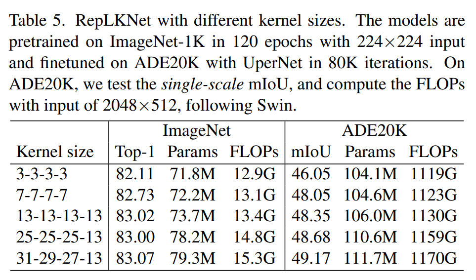

在接下来的子章节中，我们使用高训练配置的 RepLKNet-31 在 ImageNet 分类任务、Cityscapes/ADE20K 语义分割任务和 COCO 对象检测任务上，与表现最优的模型进行比较。我们将前面提到的模型称为 RepLKNet-31B（B 代指 Base），并添加一个 $\mathbf C = [192, 384, 768, 1536]$ 的更宽的模型 RepLKNet-31L（Large）。我们再构建另一个模型 RepLKNet-XL，该模型 $\mathbf C = [256, 512, 1024, 2048]$，且 DW 大卷积层的通道数等于输入通道数的 $1.5$ 倍。

### 4.3. ImageNet Classification
由于 RepLKNet 整体架构类似于 Swin，我们先拿二者进行对比。我们先令 RepLKNet-31B 在 ImageNet-1K 上用先前的配置训练 $300$ 个 epoch，再将输入分辨率更改至 $384 \times 384$，微调 $30$ 个 epoch。这样的训练费用是远低于 Swin-B 的。另外地，我们在 ImageNet-22K 上预训练 RepLKNet-B/L 模型，然后再在 ImageNet-1K 上进行微调。RepLKNet-XL 在我们的私有半监督数据集 MegData37M（参见附录）上预训练。我们还在同一张 2080Ti GPU 上测试了当 batch size 为 $64$ 时的模型吞吐量（throughput）。训练参数参见附录。

表 $\color{red}6$ 说明，尽管大卷积核对 ImageNet 分类任务作用不大，但 RepLKNet 仍然以较少的效率降低换取了可观的准确率提升。值得注意的是，仅使用 ImageNet-1K 训练的 RepLKNet-31B 比 Swin-B 准确率高 $0.3\%$，且速度还提高了 $43\%$。并且，虽然 RepLKNet-XL 的 FLOPs 大于 Swin-L，运行却比 Swin-L 要快，这也表现了 DW 大卷积的高效性。

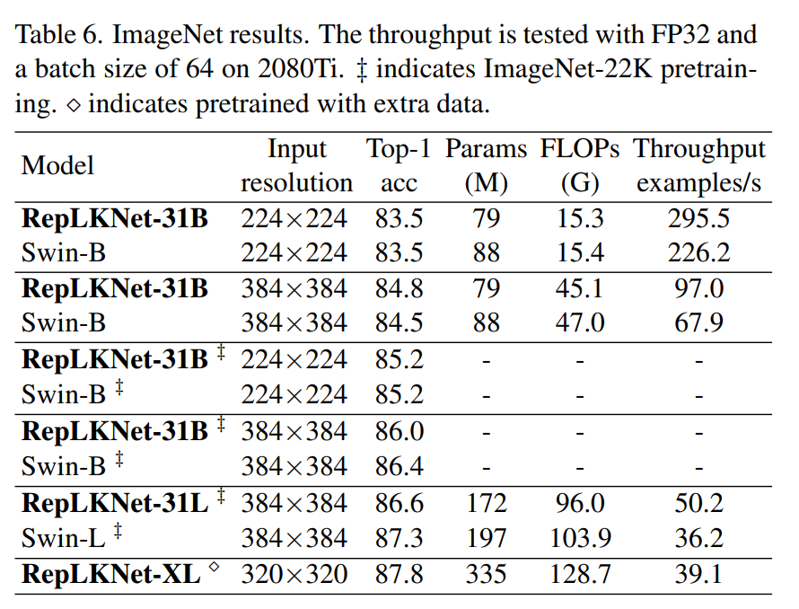

### 4.4. Semantic Segmentation 语义分割
我们将预训练好的模型作为骨架，在 Cityscapes（表 $\color{red}7$）和 ADE20K（表 $\color{red}8$）上进行语义分割训练。我们使用 MMSegmentation 实现的 UperNet 作为框架，分别在 Cityscapes 和 ADE20K 上训练 $8$ 万和 $16$ 万个迭代，不带其他修改。

在 Cityscapes 上，使用 ImageNet-1K 预训练的 RepLKNet-31B 比 Swin-B 的单尺度 mIoU 高了 $2.7$，甚至高于使用 DiversePatch（ViT 专用的改进技术）并在 ImageNet-21K 上预训练的、拥有两倍参数量的 Swin-L。在 ADE20K 上，RepLKNet-31B 也比使用同等大小的 ImageNet 预训练集的 Swin-B 表现显著更优，RepLKNet-XL 更是达到了 $56.0$ 的 mIoU，展示了 RepLKNet 在大尺度 CV 任务上的优秀能力。

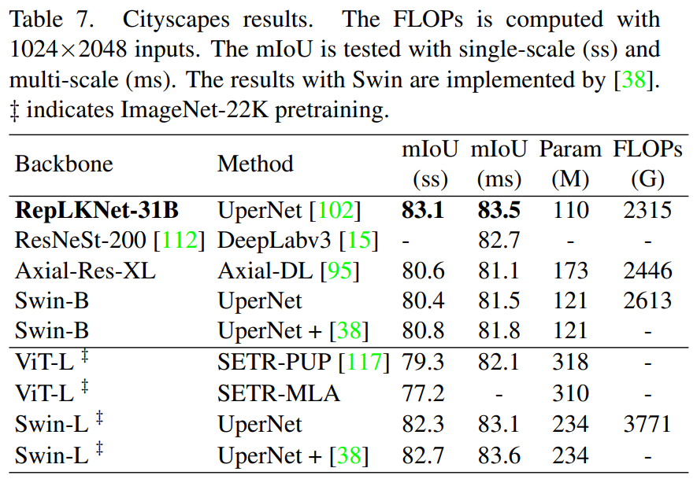

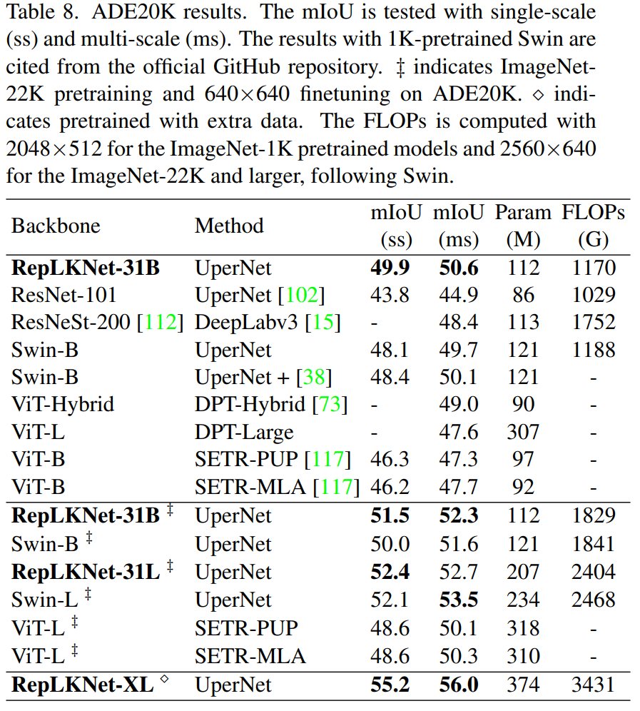

### 4.5. Object Detection 对象检测
