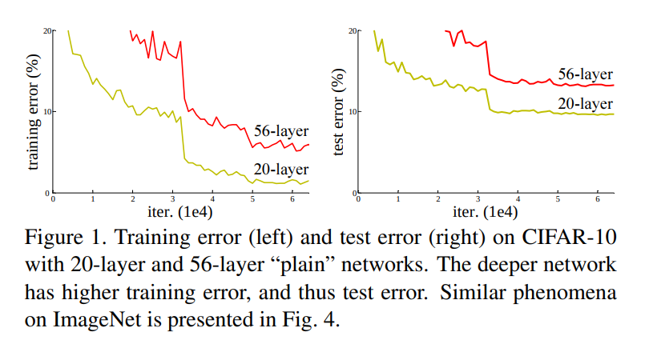
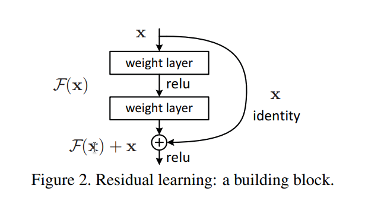
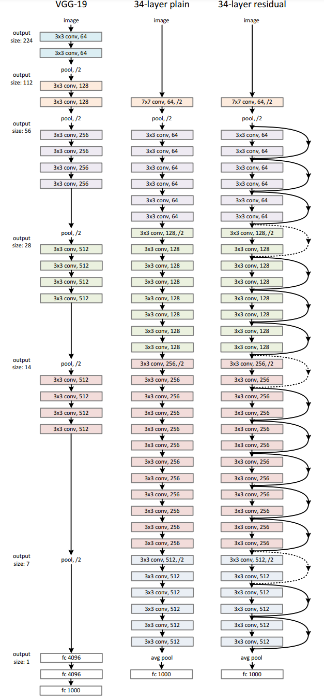

# ResNet 学习笔记
*原文：[Deep Residual Learning for Image Recognition](https://arxiv.org/abs/1512.03385)*

## Abstract 摘要
为促进层数较多的神经网络的训练，本文提出了残差网络（residual net）。在实践中，通过让神经元层学习关于输入的残差，我们能使得模型更容易优化，且在一定限度内随着深度增加，准确率也相应变高。使用残差网络可以在增加层数的同时保证训练的可行性，使得表现更加优秀。

## 1. Introduction 导言
足够多的层数对很多图像识别任务都是至关重要的。然而一昧增加层数会导致各种问题，例如梯度消失 / 梯度爆炸。这一问题已经被正
则层极大地改善，允许我们用 SGD 训练带有十层神经元的神经网络至拟合。

但是出现了新的问题：网络的**退化**。随着深度增加，准确率先达到饱和，然后突然大幅下降。令人意外地，这一下降**不是**由过拟合引起的，且引入更多的神经元层反而导致更加**欠拟合**。已有另两篇论文提出了这一点，我们的实验也验证了这一点，如图 1。

准确率的退化表明：不是所有网络都一样容易训练。理论上来讲，我们很容易通过构造方法——添加多个恒等层（$f(x) = x$）增加网络的层数而保持其效果不变，所以更深的网络应当不劣于浅的网络。可事实却是，我们手头的工具难以让我们在有限时间内找到不劣于这个构造解的深层网络。

在本文中，我们通过引入**深残差网络**（deep residual learning framework）来解决退化问题。传统方法是让神经元层学习原映射，残差网络则是让神经元层学习残差映射。形式化地，假设目标原映射是 $\mathcal H(\textbf x)$，则我们让残差网络学习的映射为 $\mathcal F(x) := \mathcal H(\textbf x) - \textbf x$，输出为 $\mathcal F(x) + \textbf x$。我们假设这样做更方便学习，或者举个极端的例子，如果 $\mathcal H(\textbf x)$ 约等于恒等函数，那训练网络输出接近 $0$ 要比用一堆非线性层训练它接近恒等函数简单地多。

实现这一结构如图 2。

这一结构不增加多余的变量或计算复杂度，只要做一些简单的改动就能照常使用 SGD 训练。旁边的恒等传递被称为一种**捷径连接**（shortcut connnection）。

实验结果表明，在层数较多时使用残差网络比普通网络更容易训练，准确率提升也相当明显，能训练 100 多层的网络，甚至可以尝试超过 1000 层的网络。

介绍一些使用残差网络取得的成就，此处不做摘录。

## 2. Related Work 相关工作
介绍了一些前人的工作，这些工作对残差网络的提出具有启发意义，例如 VLAD 使用了残差向量，前人关于捷径连接的研究等。

## 3. Deep Residual Learning 深残差学习
### 3.1. Residual Learning 残差学习
虽然看起来拟合 $\mathcal H(\textbf x)$ 和 $\mathcal H(\textbf x) - \textbf x$ 是等价的，但实际表现却不一样。退化问题表明，用多个非线性层拟合恒等函数是有困难的。但如果是拟合输出为 $0$，只需要让所有参数接近于 $0$ 就可以了。

### 3.2. Identity Mapping by Shortcuts 使用捷径进行恒等映射
我们对所有神经层都添加一个残差。形式化地，本文中，我们定义一个块（building block）为：

$$\textbf y = \mathcal F(\textbf x, \{W_i\}) + \textbf x. \tag{1}$$

在块之后我们还会应用一次非线性函数（即 $\sigma(\textbf y)$，见图 2）。

如果 $\mathcal F(\textbf x, \{W_i\})$ 和 $\textbf x$ 维数不同，可以考虑做一个线性变换，即

$$\textbf y = \mathcal F(\textbf x, \{W_i\}) + W_s \textbf x. \tag{2}$$

虽然在 $(1)$ 中我们也可以使用一个 $W_s$ 进行变换，但实践表明，直接用恒等变换就足够了，不需要再额外增加运算量和参数。

同时，$\mathcal F$ 的结构是可变的，但如果只有一层神经元，$\mathcal F$ 就会等价于 $W_1\textbf x + \textbf x$，不会带来明显改善。

### 3.3. Network Architectures 网络架构
在测试多个架构后，可观测到一些共性。为了比较，下面我们使用两个模型在 ImageNet 上进行测试。

**朴素网络**（图 3 中）。这一设计受 VGG 网络（图 3 左）的设计思想启发。卷积层基本都是 $3 \times 3$ 的，且特征边长和通道数之积恒定，保证每层的计算复杂度相等。降采样（downsampling）的方式是应用一个 stride 为 $2$ 的卷积层。结尾是个 global average pooling layer（将 $512$ 个层分别取平均值，转化为 $512$ 个平均数），然后接 softmax 的全连接层。图中的“pool, /2”指的是核为 $3 \times 3$，stride 为 $2$ 的最大池化层（maxpooling layer）。

需要注意的是，$7 \times 7$ 的卷积层应设置 padding 为 $3$，$3 \times 3$ 的卷积层和最大池化层应设置 padding 为 $1$，

可以注意到，我们的模型比 VGG 网络有着更少的特征层和更低的计算复杂度，前者需要 $36$ 亿 FLOPs（即 $36$ 亿次乘法加法计算），是后者的 $18\%$（$196$ 亿 FLOPs）。

**残差网络**（图 3 右）。在朴素网络的基础上添加了捷径，实线表示维数不变，虚线表示维数变化。对于维数变化的捷径，可以考虑两种方式：（A）直接做恒等映射，新增加的特征层全部补 $0$，此方法不需要额外参数；（B）仿照 $(2)$ 式做 $1 \times 1$ 卷积（线性变换），此方法需要额外参数。

（关于此处（A）方法的恒等映射有个疑问：既然图像边长缩小一半，那这里的恒等映射又要怎么做？网络上似乎没有什么答案，只找到了一个 StackExchange 的[提问](https://stats.stackexchange.com/questions/252033/are-shortcut-connections-with-stride-1-still-identity-mappings-in-resnets)，只有一个回答，说不需要在意这一点，直接截取即可。

在复现中，我使用了直接截取以及使用一个 kernal size 为 $2 \times 2$，stride 为 $2$ 的平均池的两种不同方式。）

### 3.4. Implementation 实现
我们使用了另外两篇论文的实现方式。

1. 将每个像素亮度减去平均值（per-pixel mean subtracted）。
2. 将图像重新放缩，使其宽放缩至 $[256, 480]$ 中的随机整数，以此提高模型对放缩的适应能力（for scale augmentation）。
3. 随机决定是否水平翻转图像。
4. 随机截取一个 $224 \times 224$ 的子图。

细节方面：

1. 每次卷积后和每次应用激活函数前，都做一遍 batch normalization。
2. 使用 batch size 为 $256$ 的 SGD 进行训练。
3. 学习率为 $0.1$，当错误率稳定时改为 $0.01$。
4. 使用 [Delving Deep into Rectifiers: Surpassing Human-Level Performance on ImageNet Classification](https://arxiv.org/abs/1502.01852) 中提到的方法进行初始化（*即，令参数在正态分布 $N(0, \sqrt {2 / n_l}$ 中取随机值，其中 $n_l$ 是该层单个输出所需要计算的输入个数*）。
5. 模型最多训练 $60 \times 10^4$ 个迭代。
6. 权值衰变（weight decay）为 $10^{-4}$，动量（momentum）为 $0.9$。
7. 不使用 dropout。

测试环境中使用十折测试，生产环境中使用 [41, 13] 的全卷积形式，并取不同放缩长度（宽放缩至 $\{224, 256, 384, 480, 640\}$）的最佳平均准确率作为最优模型。

## 4. Experiments 实验
### 4.1. ImageNet Classification ImageNet 分类任务