# ResNet 学习笔记
*原文：[Deep Residual Learning for Image Recognition](https://arxiv.org/abs/1512.03385)*

## Abstract 摘要
为促进层数较多的神经网络的训练，本文提出了残差网络（residual net）。在实践中，通过让神经元层学习关于输入的残差，我们能使得模型更容易优化，且在一定限度内随着深度增加，准确率也相应变高。使用残差网络可以在增加层数的同时保证训练的可行性，使得表现更加优秀。

## 1. Introduction 导言
足够多的层数对很多图像识别任务都是至关重要的。然而一昧增加层数会导致各种问题，例如梯度消失 / 梯度爆炸。这一问题已经被正
则层极大地改善，允许我们用 SGD 训练带有十层神经元的神经网络至拟合。

但是出现了新的问题：网络的**退化**。随着深度增加，准确率先达到饱和，然后突然大幅下降。令人意外地，这一下降**不是**由过拟合引起的，且引入更多的神经元层反而导致更加**欠拟合**。已有另两篇论文提出了这一点，我们的实验也验证了这一点，如图 1。

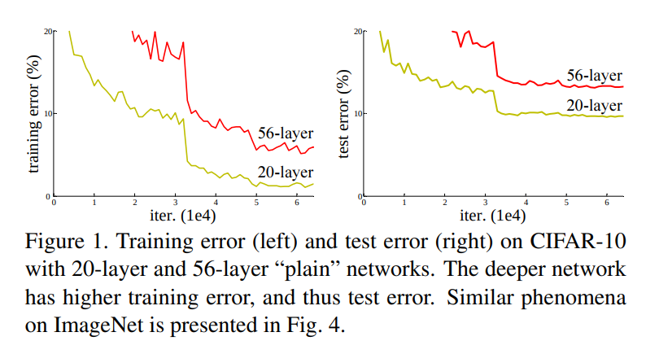

准确率的退化表明：不是所有网络都一样容易训练。理论上来讲，我们很容易通过构造方法——添加多个恒等层（$f(x) = x$）增加网络的层数而保持其效果不变，所以更深的网络应当不劣于浅的网络。可事实却是，我们手头的工具难以让我们在有限时间内找到不劣于这个构造解的深层网络。

在本文中，我们通过引入**深残差网络**（deep residual learning framework）来解决退化问题。传统方法是让神经元层学习原映射，残差网络则是让神经元层学习残差映射。形式化地，假设目标原映射是 $\mathcal H(\textbf x)$，则我们让残差网络学习的映射为 $\mathcal F(x) := \mathcal H(\textbf x) - \textbf x$，输出为 $\mathcal F(x) + \textbf x$。我们假设这样做更方便学习，或者举个极端的例子，如果 $\mathcal H(\textbf x)$ 约等于恒等函数，那训练网络输出接近 $0$ 要比用一堆非线性层训练它接近恒等函数简单地多。

实现这一结构如图 2。

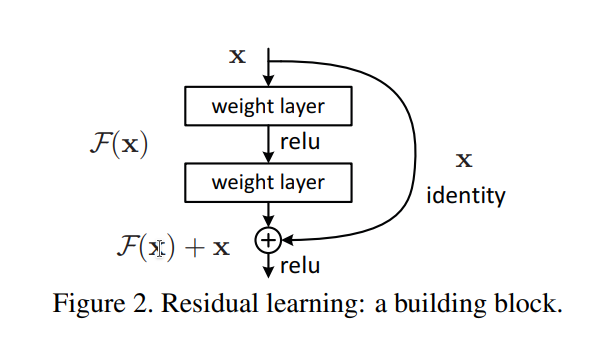

这一结构不增加多余的变量或计算复杂度，只要做一些简单的改动就能照常使用 SGD 训练。旁边的恒等传递被称为一种**捷径**（shortcut connnection）。

实验结果表明，在层数较多时使用残差网络比普通网络更容易训练，准确率提升也相当明显，能训练 100 多层的网络，甚至可以尝试超过 1000 层的网络。

介绍一些使用残差网络取得的成就，此处不做摘录。

## 2. Related Work 相关工作
介绍了一些前人的工作，这些工作对残差网络的提出具有启发意义，例如 VLAD 使用了残差向量，前人关于捷径的研究等。

## 3. Deep Residual Learning 深残差学习
### 3.1. Residual Learning 残差学习
虽然看起来拟合 $\mathcal H(\textbf x)$ 和 $\mathcal H(\textbf x) - \textbf x$ 是等价的，但实际表现却不一样。退化问题表明，用多个非线性层拟合恒等函数是有困难的。但如果是拟合输出为 $0$，只需要让所有参数接近于 $0$ 就可以了。

### 3.2. Identity Mapping by Shortcuts 使用捷径进行恒等映射
我们对所有神经层都添加一个残差。形式化地，本文中，我们定义一个块（building block）为：

$$\textbf y = \mathcal F(\textbf x, \{W_i\}) + \textbf x. \tag{1}$$

在块之后我们还会应用一次非线性函数（即 $\sigma(\textbf y)$，见图 2）。

如果 $\mathcal F(\textbf x, \{W_i\})$ 和 $\textbf x$ 维数不同，可以考虑做一个线性变换，即

$$\textbf y = \mathcal F(\textbf x, \{W_i\}) + W_s \textbf x. \tag{2}$$

虽然在 $(1)$ 中我们也可以使用一个 $W_s$ 进行变换，但实践表明，直接用恒等变换就足够了，不需要再额外增加运算量和参数。

同时，$\mathcal F$ 的结构是可变的，但如果只有一层神经元，$\mathcal F$ 就会等价于 $W_1\textbf x + \textbf x$，不会带来明显改善。

### 3.3. Network Architectures 网络架构
在测试多个架构后，可观测到一些共性。为了比较，下面我们使用两个模型在 ImageNet 上进行测试。

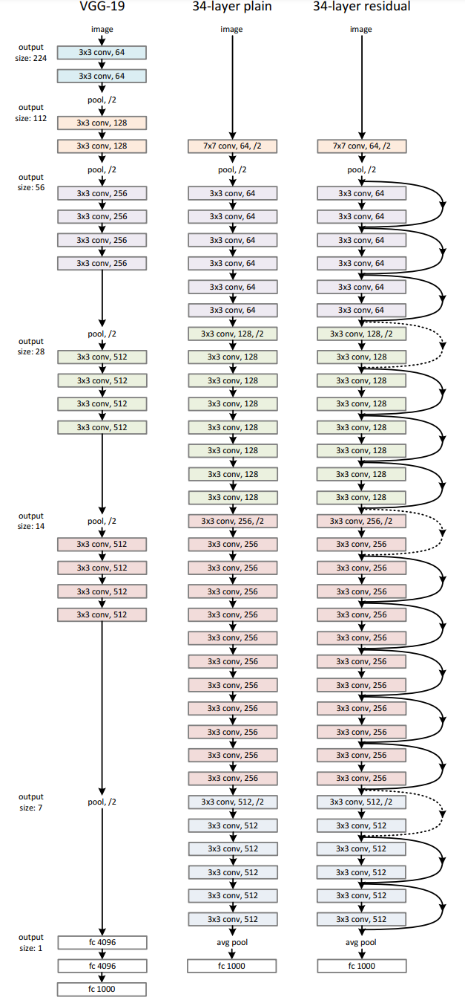

**朴素网络**（图 3 中）。这一设计受 VGG 网络（图 3 左）的设计思想启发。卷积层基本都是 $3 \times 3$ 的，且特征边长和通道数之积恒定，保证每层的计算复杂度相等。降采样（downsampling）的方式是应用一个 stride 为 $2$ 的卷积层。结尾是个 global average pooling layer（将 $512$ 个层分别取平均值，转化为 $512$ 个平均数），然后接 softmax 的全连接层。图中的“pool, /2”指的是核为 $3 \times 3$，stride 为 $2$ 的最大池化层（maxpooling layer）。

需要注意的是，$7 \times 7$ 的卷积层应设置 padding 为 $3$，$3 \times 3$ 的卷积层和最大池化层应设置 padding 为 $1$，

可以注意到，我们的模型比 VGG 网络有着更少的特征层和更低的计算复杂度，前者需要 $36$ 亿 FLOPs（即 $36$ 亿次乘法加法计算），是后者的 $18\%$（$196$ 亿 FLOPs）。

**残差网络**（图 3 右）。在朴素网络的基础上添加了捷径，实线表示维数不变，虚线表示维数变化。对于维数变化的捷径，可以考虑两种方式：（A）直接做恒等映射，新增加的特征层全部补 $0$，此方法不需要额外参数；（B）仿照 $(2)$ 式做 $1 \times 1$ 卷积（线性变换），此方法需要额外参数。

（关于此处（A）方法的恒等映射有个疑问：既然图像边长缩小一半，那这里的恒等映射又要怎么做？网络上似乎没有什么答案，只找到了一个 StackExchange 的[提问](https://stats.stackexchange.com/questions/252033/are-shortcut-connections-with-stride-1-still-identity-mappings-in-resnets)，只有一个回答，说不需要在意这一点，直接截取即可。

在复现中，我使用了直接截取以及使用一个 kernal size 为 $2 \times 2$，stride 为 $2$ 的平均池的两种不同方式。）

### 3.4. Implementation 实现
我们使用了另外两篇论文的实现方式。

1. 将每个像素亮度减去平均值（per-pixel mean subtracted）。
2. 将图像重新放缩，使其宽放缩至 $[256, 480]$ 中的随机整数，以此提高模型对放缩的适应能力（for scale augmentation）。
3. 随机决定是否水平翻转图像。
4. 随机截取一个 $224 \times 224$ 的子图。

细节方面：

1. 每次卷积后和每次应用激活函数前，都做一遍 batch normalization。
2. 使用 batch size 为 $256$ 的 SGD 进行训练。
3. 学习率为 $0.1$，当错误率稳定时改为 $0.01$。
4. 使用 [Delving Deep into Rectifiers: Surpassing Human-Level Performance on ImageNet Classification](https://arxiv.org/abs/1502.01852) 中提到的方法进行初始化（*即，令参数在正态分布 $N(0, \sqrt {2 / n_l}$ 中取随机值，其中 $n_l$ 是该层单个输出所需要计算的输入个数*）。
5. 模型最多训练 $60 \times 10^4$ 个迭代。
6. 权重衰变（weight decay）为 $10^{-4}$，动量（momentum）为 $0.9$。
7. 不使用 dropout。

测试环境中使用十折测试，并取不同放缩长度（宽放缩至 $\{224, 256, 384, 480, 640\}$）的最佳平均准确率作为最优模型。

## 4. Experiments 实验
### 4.1. ImageNet Classification ImageNet 分类任务
我们在 ImageNet 2012 分类任务训练集上评估模型。

**朴素网络**。我们测试了 $18$ 层和 $34$ 层的模型，模型构造参见表 1。

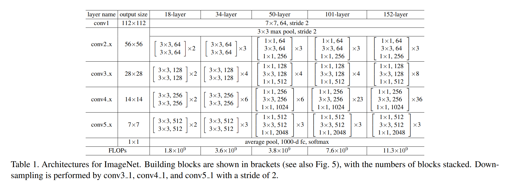

表 2 的实验结果说明，朴素网络下 $34$ 层的表现劣于 $18$ 层。在图 4 中比较二者的错误率，可以观测到模型的退化现象。

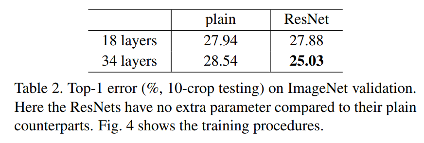

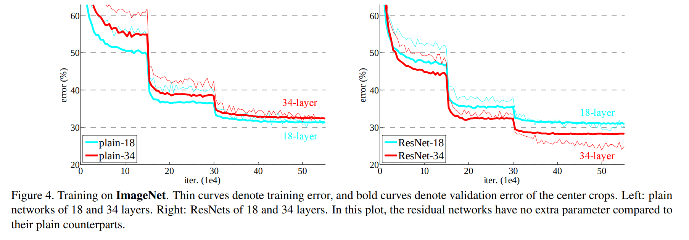

我们认为，这一问题不太可能是梯度消失导致的——经过验证可知，带 BN 层的前反向传播时方差和梯度均不为 $0$。我们推测，层数较多的网络可能更难以收敛，导致训练集错误率难以下降。具体原因仍待进一步研究。

**残差网络**。在第一次测试（表 2 和图 4 右），我们使用恒等映射作为捷径，新通道不受捷径影响（即对新通道使用 zero-padding）。因而，这些模型没有额外的参数。

我们从表 2 和图 4 中可以观察到三个现象：

1. ResNet 解决了退化问题；
2. $34$ 层的 ResNet 比同层的朴素网络表现更优；
3. $18$ 层的 ResNet 和同层的朴素网络表现相近，但收敛速度更快。

**恒等映射 vs. 线性映射**。接下来，我们探究式 $(2)$ 中提到的线性映射捷径。在表 3 中，我们比较了三种捷径的计算方式：（A）全部使用恒等映射；（B）维数不变时使用恒等映射，维数变化时使用线性映射；（C）全部使用线性映射。

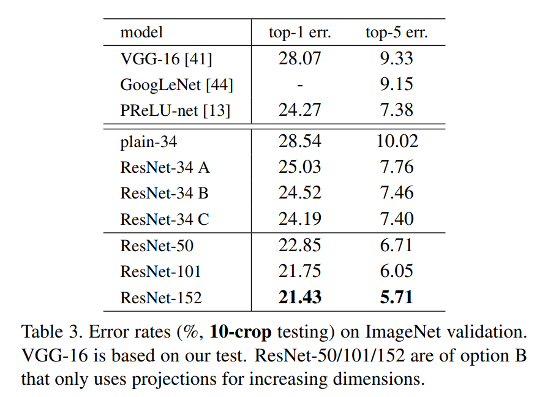

表 3 说明，三种方式都比朴素网络要好。（B）比（A）表现略好一些，我们认为这是因为当维度变化时使用恒等映射，会导致新通道无法获得残差。（C）比（B）表现略好一些，我们认为这是因为模型在其他捷径里引入了更多的参数。尽管如此，A/B/C 的细微差别并不影响退化现象，故我们在下文不考虑使用增加过多时空复杂度的方式（C）。对于下文中要介绍的 bottleneck 结构，恒等捷径在抑制复杂度增加方面起到了至关重要的作用。

**在大模型中使用 bottleneck 块**。接下来我们考虑在 ImageNet 上使用更深的网络。为了缩短训练时间，我们可以把残差块更改为 bottleneck 块。对残差函数 $\mathcal F$，我们使用 $3$ 个神经元层来实现 bottleneck 块（参见图 5）。这三层神经元分别是 $1 \times 1$、$3 \times 3$ 和 $1 \times 1$ 大小的卷积，其中 $1 \times 1$ 卷积用于降维（减少计算量）和升维（还原信息），$3 \times 3$ 卷积用于实际计算。下面图 5 展示了两个残差块的结构，这两个块的时间复杂度相近。

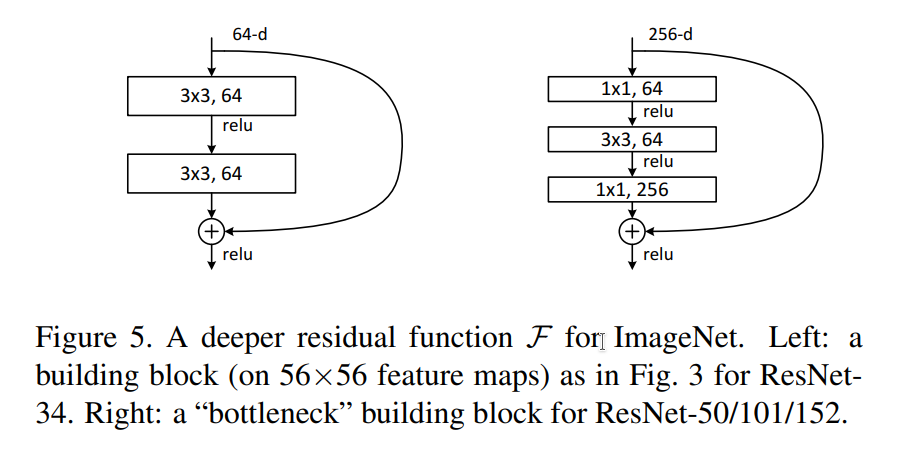

恒等捷径对 bottleneck 块来说至关重要。若使用带参数的线性映射替换恒等映射，会使得时间复杂度和模型复杂度翻倍，因而使用恒等捷径是更高效的选择。

**ResNet-50**：我们将 ResNet-34 内的每个残差块替换为 bottleneck 块，可得到 ResNet-50（表 1）。当维度增加时，我们使用线性映射。该模型的 FLOPs 为 $38$ 亿。

**ResNet-101 和 ResNet-152**：我们使用更多 bottleneck 块构建 ResNet-101 和 ResNet-152（表 1）。值得一提的是，ResNet-152 的 FLOPs（$113$ 亿）仍比 VGG-16/19（$153$ / $196$ 亿）低。

在各项测试上，ResNet-50/101/152 比 ResNet-34 表现都更好（表 3 和表 4）。使用六个不同深度的模型做集成训练（其中仅两个为 ResNet-152），我们夺得了 ILSVRC 2015 的冠军（表 5）。

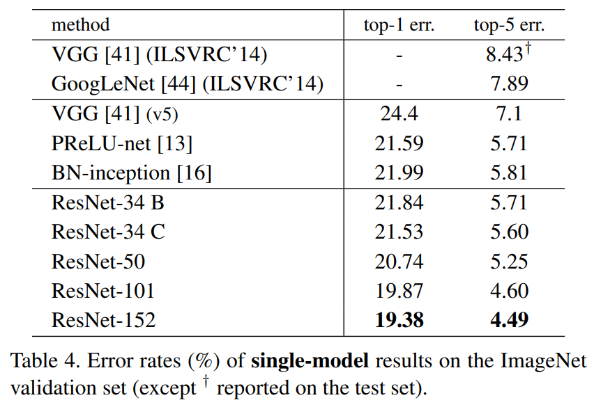

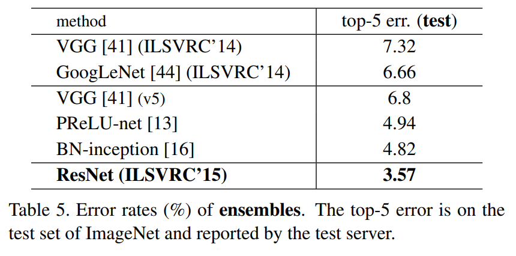

### 4.2. CIFAR-10 and Analysis CIFAR-10 和实验分析
为了更进一步探究深层模型的性质，我们在 CIFAR-10 上进行实验，并采用如下所述的简单架构。

模型架构遵循图 3 中 / 右。模型输入为 $32 \times 32$ 大小的图像，逐像素减去输入图像平均值（per-pixel mean subtracted）。第一层为 $3 \times 3$ 卷积，然后是 $6n$ 层 $3 \times 3$ 卷积，每个阶段各有 $2n$ 层，特征图大小分别为 $\{32, 16, 8\}$，通道数分别为 $\{16, 32, 64\}$，降采样时卷积步长为 $2$。模型最后为一个全局平均池化层、一个全连接层和一个 softmax 层。模型共有 $6n + 2$ 个带参数的层。

| 阶段  |  输出图像大小  |   层数   | 通道数 |
| :---: | :------------: | :------: | :----: |
|  $1$  | $32 \times 32$ | $2n + 1$ |  $16$  |
|  $2$  | $16 \times 16$ |   $2n$   |  $32$  |
|  $3$  |  $8 \times 8$  |   $2n$   |  $64$  |

我们为所有捷径使用恒等捷径，因而我们的 ResNet 和朴素模型有着相同的宽度、深度和参数量。

训练方法和 ImageNet 基本相同，但：

* Batch size 改为 $128$，在两个 GPU 上进行运算。
* 学习率初始为 $0.1$，在第 $32000$ 和 $48000$ 个迭代将其除以 $10$，并训练 $64000$ 个迭代。
* 将 CIFAR-10 的原训练集（$50000$ 张图像）分为 $45000$ 张图像（作为训练集）和 $5000$ 张图像（作为验证集）。
* 对于数据处理：当训练时，将每一边附加 4 个像素的 padding 并随机截取 $32 \times 32$ 的子图，再随即决定是否水平翻转；当测试时，直接使用原图。

我们比较了 $n = \{3, 5, 7, 9\}$，即 $20, 32, 44, 56$ 层的模型。图 6 左、中分别展示了朴素模型和 ResNet 的训练结果，表明在一定限度内，层数越多，朴素模型表现越差，ResNet 表现越好。

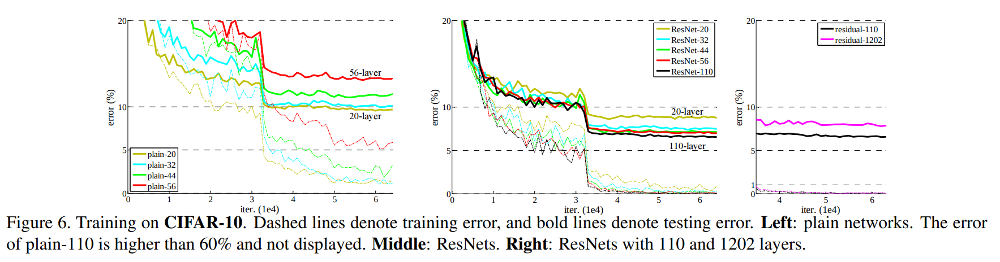

我们更进一步探究了 $n = 18$ 对应的 $110$ 层模型。此时，将学习率设为 $0.1$ 可能过高，因而我们将初始学习率设为 $0.01$，直到训练集错误率低于 $80\%$（约 $400$ 个迭代）时调回 $0.1$，此后学习率调整方式仍与前文相同。该模型比其他例如 FitNet 和 Highway 这样深而窄的模型参数更少，但却几乎达到了最高的准确率（表 6）。

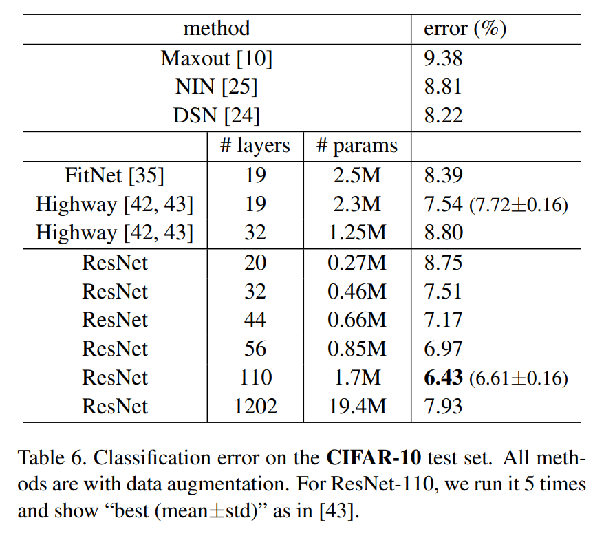

**分析中间层输出的数值分布**。图 7 展示了 $3 \times 3$ 卷积层输出的标准差（在 BN 后，在 ReLU / 加值前）。我们在 3.1 节中提到，残差函数相比原函数来讲更可能接近于 $0$，而该图确实证明了 ResNet 卷积层输出的值比朴素模型标准差更小。此外还可以发现，层数越深的 ResNet 卷积层输出的标准差也更小，这说明层数更深的 ResNet 中，单个层对输入的修改会更小。

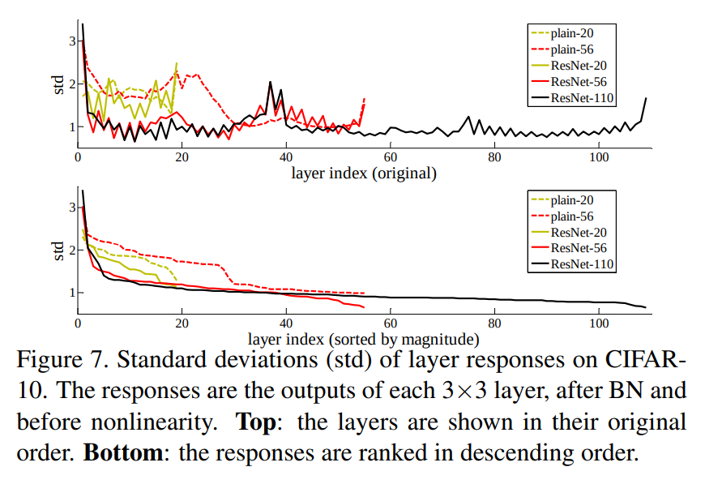

**探究超过 $1000$ 层的模型**。我们探究 $n = 200$ 时的模型 ResNet-1202，发现该模型仍然表现优秀（图 6 右和表 6），但比 ResNet-110 表现更劣。可以发现，二者训练集错误率很相近，但测试集错误率却相差较大，这说明 ResNet-1202 可能出现了过拟合现象。使用诸如 maxout 和 dropout 的正则化技术可以缓解过拟合现象，但这并非本文的重点，因而等到以后再研究。

### 4.3. Object Detection on PASCAL and MS COCO 在 PASCAL 和 MS COCO 上运行对象检测
ResNet 在其他识别任务上也表现出了卓越的泛化能力。表 7 和 8 展示了 PASCAL VOC 2007、2012 和 COCO 数据集上的对象检测基准结果。我们将 Faster R-CNN 作为检测方式，并仅仅将 VGG-16 替换为 ResNet-101，以此夺得了 ILSVRC & COCO 2015 竞赛中 ImageNet 检测、ImageNet 定位、COCO 检测、COCO 划分项目的冠军。细节参见附录。

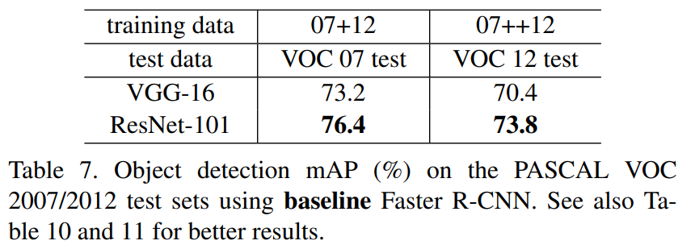

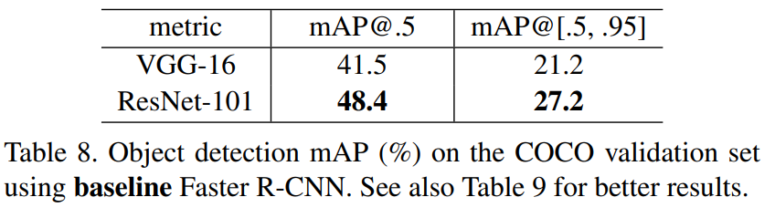