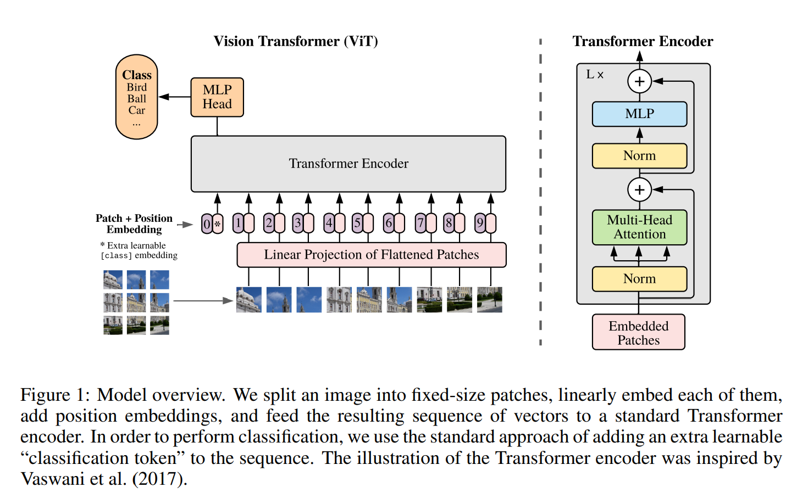
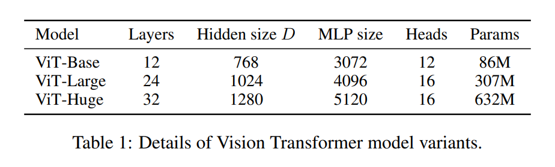
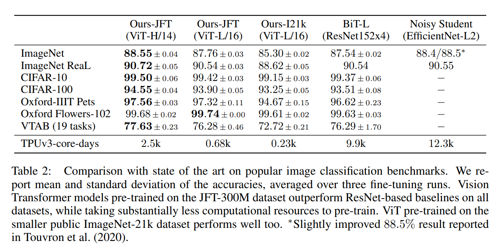

# ViT 学习笔记
*原文：[An Image is Worth 16x16 Words: Transformers for Image Recognition at Scale](https://arxiv.org/abs/2010.11929)*

*吐槽：ViT 其实应该在 ConvNeXt 之前学的，然而在任务要求里却是先写的 ConvNeXt 再写的 ViT……*

## Abstract 摘要
虽然 Transformer 结构已成为 NLP 任务的标准结构，但其在 CV 领域的潜能仍有待开发。目前来看，注意力机制要么和 CNN 一起使用，要么替换 CNN 的某些组成部分。然而我们的研究表明：注意力机制并不必须依赖于 CNN，如果我们用纯粹的 Transformer 去处理一系列的图像补丁（sequences of image patches），同样能在图像分类任务上表现得相当优秀。只要先在大量的数据上进行预训练，然后再迁移学习（transfer）到中等或小数据集的图像识别任务上（如 ImageNet，CIFAR-100，VTAB 等），Vision Transformer（ViT）就能产生比最先进的模型还要优秀的效果，同时需要的计算资源还更少。

## 1 Introduction 导言
自注意力机制，特别是 Transformers，已经成为 NLP 模型的最优选。它的主要训练方法是，先在大量的文本上进行预训练，再在更小的、某个特定于任务的数据集上进行微调。多亏了 Transformers 计算上的高效性和可扩展性，训练空前巨大的、带有超过 1000 亿参数的模型成为了可能。随着模型和数据集的扩张，它们在任务上取得的效果一直都越来越好，仍未达到饱和。

相反地，CNN 仍在 CV 领域占主导地位。受 NLP 成功启发，有不少人尝试将类 CNN 结构与自注意力机制结合，有的尝试完全替换掉 CNN。后者虽然理论上更优秀，但由于使用了特定的某些注意力模式（the use of specialized attention patterns），仍然难以在实践中发挥潜能。因此，在大规模图像识别上，经典的类 ResNet 模型仍然是最先进的模型。

受 Transformer 在 NLP 的应用启发，我们尝试将 Transformer 直接应用到图像上，并做尽可能少的改动。为了实现这一点，我们将一幅图像分成若干个补丁（patches），并将它们做线性嵌入（linear embeddings），然后再将得到的序列提供给 Transformer。也就是说，图像补丁就类似于 NLP 中的 tokens。我们用监督学习的方式，在图像分类任务上训练该模型。

当不带着先验假设在中等大小的数据集（如 ImageNet）上训练时，这一模型比大小相近的 ResNet 准确率低一些百分点。这一结果似乎令人泄气，但其实是可预料的：Transformer 相比 CNN 缺少一些感应式的特性，比如平移不变性和局部性，因此在不够多的数据集下表现不优。

然而，当模型在更大的数据集（1 千万 ~ 3 亿幅图像）上训练时，这一现象有了改观。我们发现大规模训练能使得 Transformer 比带先验假设（inductive bias）的 CNN 表现更优秀。我们的 Visual Transformer（ViT）先在大规模训练集上预训练，再迁移到小数据集上，就能表现得十分优秀。

## 2 Related Work 相关工作
介绍一些相关工作。

## 3 Method 方法
在模型设计上，我们尽可能地遵从原始 Transformer 的设计。这样做可以使得 NLP Transformer 的各种衍生结构和高效实现几乎可以直接套用到我们的模型上来。

### 3.1 Vision Transformer (ViT)
图 1 展示了本模型的概况。

标准 Transformer 接受 1D token 序列作为输入。要处理图像，我们将原图像 $\textbf x \in \R^{H \times W \times C}$ 转化为摊平了的 2D 补丁序列 $\textbf x_p \in \R^{N \times (P^2 \cdot C)}$，其中 $H, W, C$ 是图像的高、宽、通道数，$P$ 是补丁的边长，$N = HW / P^2$ 是补丁个数，也是 Transformer 输入序列的长度。Transformer 需要用大小为 $D$ 的潜在向量（latent vector）扫描过所有层，因此我们应摊平补丁序列，并用一个可训练的线性映射（式 1）映射到 $D$ 维。我们将此输出称为补丁的嵌入（patch embeddings）。

和 BERT 的 `[class]` token 类似，我们在补丁序列前添加一个可学习的嵌入（$\textbf z_0^0 = \textbf x_{\text {class}}$），其经过计算后得到的输出 $\textbf z_L^0$ 代表图像表征（image representation）$\textbf y$（式 4）。在预训练和微调阶段，都会有一个用于输出分类的 head 附加于 $\textbf z_L^0$ 上。这个 head 在预训练阶段为带一个隐藏层的 MLP（multilayer perceptron，多层感知机），微调阶段为一个线性层。

同时，为了保留位置信息，位置嵌入（position embeddings）也会加到补丁嵌入上。由于使用更复杂的 2D 嵌入并不能带来显著的提升（见附录 D.4），我们使用标准的、可学习的 1D 位置嵌入。

Transformer 编码器由交替排列的多头自注意力层（multiheaded self-attention，MSA）和 MLP 块（式 2, 3）组成。在每个块前进行 Layernorm（LN），块后进行残差连接。

MLP 由两个层组成，使用 GELU 作为激活函数：

$$
\begin{aligned}
\textbf z_0 &= [\textbf x_{\text {class}}; \textbf x^1_p \textbf E; \textbf x^2_p \textbf E; \ldots; \textbf x^N_p \textbf E] + \textbf E_{pos},    & & \textbf E \in \R^{(P^2 \cdot C) \times D}, \textbf E_{pos} \in \R^{(N + 1) \times D} & \quad (1) \\
\textbf z'_l &= \operatorname{MSA}(\operatorname{LN}(\textbf z_{l - 1})) + \textbf z_{l - 1}, & & l = 1 \ldots L & \quad (2) \\
\textbf z_l &= \operatorname{MLP}(\operatorname{LN}(\textbf z'_l)) + \textbf z'_l, & & l = 1 \ldots L & \quad (3) \\
\textbf y &= \operatorname{LN}(\textbf z^0_L), & &  & \quad (4) \\
\end{aligned}
$$

**先验假设**（inductive bias）。可以注意到，ViT 比 CNN 有更少的对于特定图像的先验假设。对 CNN，局部性、二维邻域结构（two-dimensional neighborhood structure）、平移不变性对整个模型的每一层都成立。对 ViT，只有 MLP 层有局部性和平移不变性，而自注意力层是全局性的；二维领域结构则用得很稀少：只有在开头将图像切成若干补丁，以及微调时调整位置嵌入使其符合不同分辨率时，使用到了二维邻域结构。除此之外，初始化时位置嵌入甚至不带任何关于 2D 位置的信息，这些关系必须靠模型从头开始学起。

**复合结构**（hybrid structure）。作为图像补丁的另一个替代方法，输入序列也可以用 CNN 输出的特征序列代替。在此复合模型中，补丁嵌入映射 $\mathbf E$（式 1）会应用于 CNN 特征映射导出的每个补丁上。此时补丁大小为 $1 \times 1$，这意味着只需要摊平特征序列再映射到 Transformer 所需的输入维度上，就能得到输入序列。

### 3.2 Fine-tuning and Higher Resolution 微调，以及更高的分辨率
通常地，我们在大数据上预训练 ViT，再在（更小的）下游任务上进行微调。微调时，我们移除预训练的预测 head，替换成一个初始化参数全为 $0$ 的、$D \times K$ 大小的全连接层，其中 $K$ 是下游分类个数。通常在比预训练更高的分辨率上进行微调效果会更好。当使用大图像作为输入时，我们保持补丁大小不变，会得到更长的输入序列。ViT 本身可以处理不同长度的序列（在内存限制内），但这会导致预训练的位置嵌入失去意义。因此，我们根据原图像中的位置，对预训练的位置嵌入做 2D 插值。再次提醒：这一分辨率调整和开始时的补丁分割是 ViT 仅有的关于 2D 结构的先验假设。

## 4 实验
我们评估了 ResNet、ViT 和二者复合模型的表征学习能力。为了更好地了解这些模型适合什么样的数据，我们在不同大小的数据集、不同的任务上预训练了这些模型。当考虑预训练的计算费用时，ViT 表现得非常优秀，以更小的预训练计算费用，在大部分识别任务上达到了最优。最后，我们用自监督学习（self-supervision）做个小实验，以此说明自监督 ViT 在未来有可能实现。

### 4.1 Setup 准备
**数据集**。为了探究模型的通用性，我们使用了 ILSVRC-2012 ImageNet 数据集，带有 $1000$ 个分类和 $130$ 万张图像（下文称作 ImageNet）；其超集 ImageNet-21k，带有 $2.1$ 万个分类和 $1400$ 万张图像；以及 JFT，带有 $1.8$ 万个分类和 $3.03$ 亿张高分辨率图像。我们根据下游任务的测试集，对预训练数据集进行去重。我们将预训练好的模型迁移到如下任务上：ImageNet 原验证集标签以及清理后的 ReaL 标签（ImageNet 团队在后来对数据集标签重新做了更精确的标注，称为 ReaL 数据集 / 标签）；CIFAR-10/100；Oxford-IIIT Pets；Oxford Flowers-102。对数据集的预处理和 [Big Transfer (BiT): General Visual Representation Learning](https://arxiv.org/abs/1912.11370) 相同。

我们也在 VTAB 分类任务里的 $19$ 个子任务上进行了评估。VTAB 评估模型对迁移到不同小数据任务的能力，每个任务提供 $1000$ 个训练数据。这些子任务分为三组：自然组——类似上面 Pets、CIFAR 等的任务；特定领域组——医疗和卫星图像；结构组——需要几何理解的，例如定位任务。

**模型变种**。我们基于 BERT 使用的配置来构造 ViT 的配置，如表 1 所示。

Base 和 Large 模型直接从 BERT 搬运而来，Huge 模型则是我们添加的更大的模型。下文我们会用简单的语言表示模型的大小和输入补丁的大小，如 Vit-L/16 表示输入补丁大小为 $16 \times 16$ 的 Large 模型。需要注意的是，Transformer 的序列长度与补丁大小平方负相关，因而补丁越小，计算成本越高。

我们用 ResNet 作为基准 CNN 模型，但我们会将 BN 层改为 GN（group normalization，组归一化）层，并使用标准化卷积。这一修改会提高模型的迁移能力，我们将修改后的模型称为 ResNet (BiT)。对于复合模型，我们将 ResNet50 (BiT) 在最后平均池化层得到的若干个特征作为输入给 ViT，补丁大小为 $1 \times 1$，也就是每个特征相当于一个补丁。这里我们采用两个方式：(i) 使用原模型；(ii) 将原模型的第 4 阶段的卷积层删去，换成同等数量的第 3 阶段的卷积层。方式 (ii) 会使得补丁数量减少一半，所以 Transformer 的输入序列长度变为 4 倍，使得 ViT 模型计算费用更加昂贵。

**训练和微调**。我们使用 $\beta_1 = 0.9, \beta_2 = 0.999$ 的 Adam 训练模型，batch size 为 $4096$，weight decay 为 $0.1$（设置高的 weight decay 有利于迁移）。在附录 D.1 中我们说明了在此设置下，Adam 比 SGD 的效果要更好，虽然这是违背往常经验的。我们还用了一个线性的学习率 warmup 和 decay，参见附录 B.1。对于微调，我们使用带动量的 SGD，batch size 为 $512$，参见附录 B.1.1。我们通过在更高的分辨率（ViT-L/16 为 $512$，ViT-H/14 为 $518$）上微调，加上 Polyak & Juditsky (1992) 的平均方式（系数为 $0.9999$）得到了表 2 的 ImageNet 结果。

